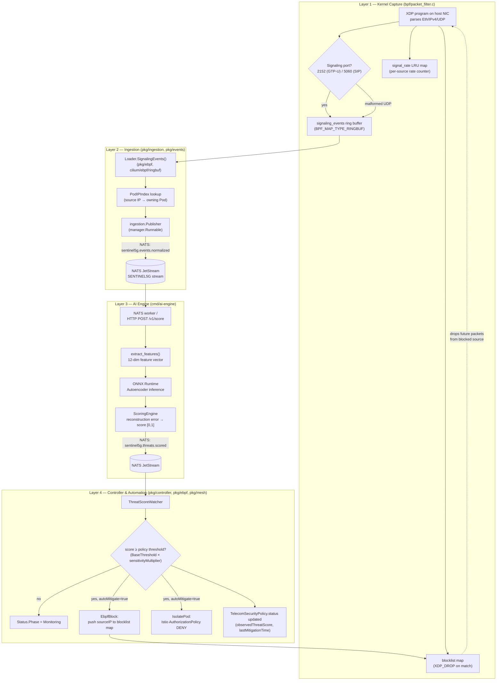

# 3. Architecture & Engineering Decisions

## 3.1 Flow diagram: Kernel (eBPF) → Ingestion (NATS) → Inference (ONNX) → Reconciliation (K8s CRD)

Sourced from the actual code path (`bpf/packet_filter.c`, `pkg/ingestion`,
`pkg/events`, `cmd/ai-engine/sentinel_ai`, `pkg/controller`), not an
idealized version of it — this is what commit `3746a89` made real end to
end.

Design principle this enforces (from `docs/architecture.md`): every layer
is independently replaceable behind an interface — `pkg/ebpf.EventSource` /
`BlocklistUpdater`, `pkg/mesh.Adapter` — so a cluster without eBPF attached
or without a service mesh still runs, degrading gracefully rather than
failing closed on a missing capability.

## 3.2 Complex bottlenecks resolved (sourced from commit history)

Each item below is quoted/paraphrased from its actual commit message —
citations are exact commit hashes in this repo, not reconstructed from
memory.

### golangci-lint v1 → v2 migration under CI (`c497b15`, `32bb2bc`, `8e7dcf3`)
Three-commit chain, each correcting the previous commit's wrong diagnosis —
worth including for the paper precisely because it shows a real
debug-under-pressure sequence, not a first-try fix:
1. `c497b15` first guessed the CI failure was a golangci-lint version drift
   and pinned to v1.
2. `32bb2bc` found the real root cause: golangci-lint v1 is unmaintained
   upstream (only v2.x is patched), and the pinned v1.64.8 binary predated
   the project's `go1.26.8` toolchain bump — "the Go language version
   (go1.24) used to build golangci-lint is lower than the targeted Go
   version." Migrated `.golangci.yml` to v2's schema via `golangci-lint
   migrate`, hand-verified 0 issues on the real v2.13.2 binary.
2. `8e7dcf3` found golangci-lint-action@v6 itself can't run a v2 binary at
   all (only v7+ understands v2) — bumped the action to v9.3.0.

### Istio `AuthorizationPolicy` DENY-with-empty-rules bug (`de2f8c3`)
Found only because the mesh adapter was exercised against a **real** Istio
1.31 control plane in k3s, not a mock: `action: DENY` with `spec.rules: []`
is rejected as meaningless by Istio's real validating webhook (an empty
rule list matches nothing, so the DENY would never fire) — `Quarantine`'s
`Create` call failed outright. Fixed to a single empty rule (`{}`, matches
every request), restoring the intended deny-all-for-selector behavior. This
is the concrete case for why `docs/architecture.md` treats "test against
the real thing, not a fake client" as a design principle rather than
boilerplate.

### NATS security review pass (`2d291ff`)
A full review-driven fix pass, not a single bug: added optional NATS
auth (NKey/JWT or user/password) and TLS end to end (previously anything
reaching an unauthenticated `NATS_URL` could forge a `ThreatScoreEvent` and
trigger a real automated mitigation); bounded JetStream redelivery
(`MaxDeliver=5`, Term instead of infinite NAK on unparseable messages);
added `gosec`/`bandit`/`govulncheck`/`pip-audit` to CI, which — running for
real, not just being wired in — surfaced and fixed 35 known Go
toolchain/stdlib CVEs, a real `cilium/ebpf` CVE (BTF parsing integer
overflow, `0.15.0 → 0.22.0`, re-verified against a live XDP attach), 10
known `onnx` CVEs, and an unsafe `torch.load` call (`weights_only=True`).

### Kernel header strategy: UAPI vs. CO-RE (`vmlinux.h`) — open tradeoff, not yet resolved
Current, deliberate choice (`docs/architecture.md`): `bpf/packet_filter.c`
uses plain UAPI kernel headers rather than a generated `vmlinux.h`, so it
builds against any recent kernel without first extracting BTF from the
target host — lower friction for a reference implementation, at the cost
of full portability across differing kernel struct layouts. `ROADMAP.md`
Phase 1 lists switching to CO-RE (`BPF_CORE_READ()`) as explicit future
work, not a bug — this is presented here as an engineering tradeoff being
tracked, not something already fixed.

### Time-of-day bias — a design decision baked in from the start, not a later fix
Worth being precise about, since it's easy to overstate: the synthetic
dataset generator's normal-traffic sampling was written from the start to
span the full 24h day uniformly, specifically to prevent the autoencoder
from keying on "unusual hour" as *the* anomaly signal and drowning out the
protocol/rate/malformed signals every other anomaly type is meant to be
judged on (`generate_synthetic_dataset.py`'s own code comment states this
reasoning directly). This is a documented design decision in the original
implementation, not a bug discovered and patched in a later commit — no
commit in this repo's history is titled or described as fixing a temporal
bias regression.

### README overclaims correction (`4a02bc2`)
A self-correction pass worth citing precisely because it demonstrates the
project holding its own public claims to the same "measured vs. target"
standard this folder uses: removed a claim that the model trains on
real-world telecom traffic (it's synthetic), reframed the `<0.2ms`/`2%`/
`8ms` figures from implied benchmarks to explicit design targets
consistent with `docs/observability.md`, and swapped an unverifiable "CNCF
Sandbox Candidate" badge for an accurate one.
