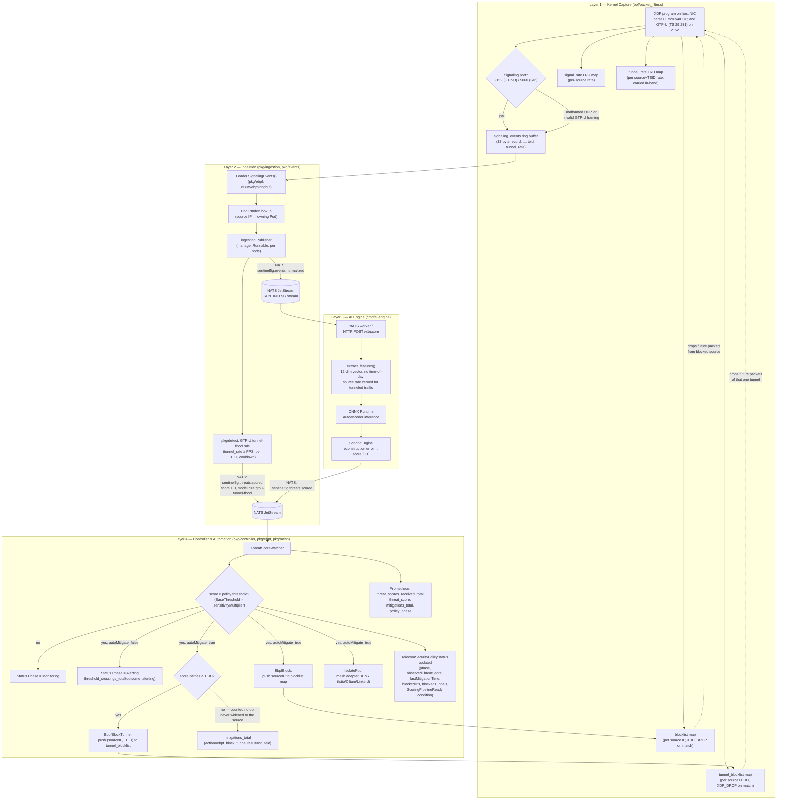

# 3. Architecture & Engineering Decisions

## 3.1 Flow diagram: Kernel (eBPF) → Ingestion (NATS) → Inference (ONNX) → Reconciliation (K8s CRD)

Sourced from the actual code path (`bpf/packet_filter.c`, `pkg/ingestion`,
`pkg/events`, `cmd/ai-engine/sentinel_ai`, `pkg/controller`), not an
idealized version of it — this is what commit `3746a89` made real end to
end.

Design principle this enforces (from `docs/architecture.md`): every layer
is independently replaceable behind an interface — `pkg/ebpf.EventSource` /
`BlocklistUpdater`, `pkg/mesh.Adapter` — so a cluster without eBPF attached
or without a service mesh still runs, degrading gracefully rather than
failing closed on a missing capability.

## 3.2 Complex bottlenecks resolved (sourced from commit history)

Each item below is quoted/paraphrased from its actual commit message —
citations are exact commit hashes in this repo, not reconstructed from
memory.

### golangci-lint v1 → v2 migration under CI (`c497b15`, `32bb2bc`, `8e7dcf3`)
Three-commit chain, each correcting the previous commit's wrong diagnosis —
worth including for the paper precisely because it shows a real
debug-under-pressure sequence, not a first-try fix:
1. `c497b15` first guessed the CI failure was a golangci-lint version drift
   and pinned to v1.
2. `32bb2bc` found the real root cause: golangci-lint v1 is unmaintained
   upstream (only v2.x is patched), and the pinned v1.64.8 binary predated
   the project's `go1.26.8` toolchain bump — "the Go language version
   (go1.24) used to build golangci-lint is lower than the targeted Go
   version." Migrated `.golangci.yml` to v2's schema via `golangci-lint
   migrate`, hand-verified 0 issues on the real v2.13.2 binary.
2. `8e7dcf3` found golangci-lint-action@v6 itself can't run a v2 binary at
   all (only v7+ understands v2) — bumped the action to v9.3.0.

### Istio `AuthorizationPolicy` DENY-with-empty-rules bug (`de2f8c3`)
Found only because the mesh adapter was exercised against a **real** Istio
1.31 control plane in k3s, not a mock: `action: DENY` with `spec.rules: []`
is rejected as meaningless by Istio's real validating webhook (an empty
rule list matches nothing, so the DENY would never fire) — `Quarantine`'s
`Create` call failed outright. Fixed to a single empty rule (`{}`, matches
every request), restoring the intended deny-all-for-selector behavior. This
is the concrete case for why `docs/architecture.md` treats "test against
the real thing, not a fake client" as a design principle rather than
boilerplate.

### NATS security review pass (`2d291ff`)
A full review-driven fix pass, not a single bug: added optional NATS
auth (NKey/JWT or user/password) and TLS end to end (previously anything
reaching an unauthenticated `NATS_URL` could forge a `ThreatScoreEvent` and
trigger a real automated mitigation); bounded JetStream redelivery
(`MaxDeliver=5`, Term instead of infinite NAK on unparseable messages);
added `gosec`/`bandit`/`govulncheck`/`pip-audit` to CI, which — running for
real, not just being wired in — surfaced and fixed 35 known Go
toolchain/stdlib CVEs, a real `cilium/ebpf` CVE (BTF parsing integer
overflow, `0.15.0 → 0.22.0`, re-verified against a live XDP attach), 10
known `onnx` CVEs, and an unsafe `torch.load` call (`weights_only=True`).

### Kernel header strategy: a hand-maintained `vmlinux_min.h`, not UAPI and not full CO-RE
An earlier revision of this section described `bpf/packet_filter.c` as
building against plain UAPI kernel headers with a switch to CO-RE tracked
as future work. That was true at the time and is stale now: since
`ROADMAP.md` Phase 1 the program builds against
`bpf/headers/vmlinux_min.h`, a small hand-maintained stand-in for a
`bpftool btf dump`-generated `vmlinux.h`. The precise claim, because it's
easy to overstate (`docs/architecture.md`): every struct the program reads
is a wire-format type whose layout is fixed by its protocol — `ethhdr`,
`iphdr`, `udphdr`, and since Phase 2.5 `gtpuhdr` (3GPP TS 29.281) — so
CO-RE's relocation mechanism has nothing to protect and is deliberately
not used. What the change bought was dropping the UAPI-header *and*
host-BTF build dependencies, which is what lets the object build inside a
plain `docker build` and get baked into the operator image.

### Time-of-day bias — designed out of the synthetic pipeline, then found in the real one
An earlier revision of this section said, correctly, that the synthetic
generator's normal-traffic sampling spans the full 24h day precisely so the
autoencoder cannot key on "unusual hour" as *the* anomaly signal, and that
no commit had ever needed to fix a temporal-bias regression. The second
half stopped being true on 2026-09-13. The real-capture pipeline
(`build_real_dataset.py`) never applied the same treatment, every real
capture is a single ~1h session, and the model trained on it scored 1.0 on
every packet of a later capture taken eleven hours away — a 100%
false-positive rate on any deployment whose traffic runs at a different
hour from the training session. Spreading the real timestamps fixed the
false positives and destroyed recall (the two features became
unreconstructable noise); the features were removed. Full measurement in
[`02-ai-training-inference.md`](02-ai-training-inference.md) §2.6.3. The
design decision was right; it just had to be applied twice, and the record
of it being applied only once is the more useful engineering note.

### README overclaims correction (`4a02bc2`)
A self-correction pass worth citing precisely because it demonstrates the
project holding its own public claims to the same "measured vs. target"
standard this folder uses: removed a claim that the model trains on
real-world telecom traffic (it's synthetic), reframed the `<0.2ms`/`2%`/
`8ms` figures from implied benchmarks to explicit design targets
consistent with `docs/observability.md`, and swapped an unverifiable "CNCF
Sandbox Candidate" badge for an accurate one. The first of those claims was
later re-added on evidence rather than assertion: once `real-dataset/` and
`real-dataset-v2/` existed and the release pipeline trained the published
artifact from them, "trains on real GTP-U" became true, and the README says
so with the captures' scope limits linked beside it.

### Phase 2.5 decisions, sourced from the branch (`6927111`…`0a5c57b`)

Each of these is a decision with a plausible alternative, recorded with why
the alternative lost. Commit messages carry the full reasoning.

- **Carry the per-tunnel rate inside the kernel's ring-buffer record rather
  than look it up from userspace (`ff08d07`).** A userspace lookup races
  the 1-second window roll and can return 1 for the very packet the kernel
  counted as the three-thousandth — worst exactly during the flood the
  counter exists to catch. The record grew 24 → 32 bytes, and `Attach` now
  refuses an object without the `tunnel_rate` map — and, since Phase 3,
  without `tunnel_blocklist` either — so a stale `.o` fails loudly instead
  of decoding every record at the wrong length or accepting a block that
  can never take effect.
- **A rule, not a retune, for the in-tunnel flood (`6102a6d`).** The
  measured anomaly reconstructed *better* than normal traffic (0.0679 vs
  0.0811); no threshold on reconstruction error separates that. The rule
  publishes an ordinary `ThreatScoreEvent` on the ordinary subject so it
  cannot bypass policy — `ThreatScoreWatcher` has no branch for it at all.
  On by default with the threshold's provenance stated, because a detector
  shipped off closes nothing.
- **The AI engine chart refuses to render without a model (`3e9f109`).**
  The alternative — install, come up healthy, silently never score — was the
  failure being fixed. CI asserts the refusal rather than trusting it.
- **Refuse a wrong-width model at startup, not per event (`28e6a39`).**
  Inside the NATS worker a shape mismatch was an exception, a nak, five
  redeliveries and a dropped event, forever, with nothing naming the cause.
- **Drop time-of-day from the model (`fd9210b`).** Found by measuring, not
  by review: 100% false positives on a capture from another hour, and the
  fix that kept the features (spreading timestamps) destroyed recall. See
  the section above.
- **Zero the per-source rate for tunneled traffic instead of removing it
  (`95b9d27`).** Removing it took bystander false positives to 0 but blinded
  the model to every untunneled storm (SIP, SMPP, off-port probes). Zeroing
  it only where a tunnel rate exists kept both.
- **Seed `PolicyIndex` from the cache before the score subscription
  (`0a5c57b`).** Found on a real cluster by the e2e: after a rollout, every
  score JetStream had buffered was matched against an empty index and
  acked away. Unit tests could not have found it; the failure is an
  ordering between two runnables and a durable consumer.
- **Four defects found only by running the real thing.** Events rejected
  by RBAC (`events.k8s.io` missing, so `EBPFAttachFailed` had never once
  landed); `helm upgrade` not restarting the operator (no ConfigMap
  checksum); a named `USER` in the AI engine image failing `runAsNonRoot`;
  and two load generators (`iperf3 -B`, UERANSIM's `nr-binder`) that report
  success while never entering the GTP-U tunnel. All four are the kind of
  thing that looks fine in a template render and a unit test.

### Phase 3 decisions (`feat/phase-3-teid-drop-and-load-harness`, 2026-09-21)

- **A second enforcement map keyed by `(saddr, TEID)`, not a widened
  `blocklist`.** The alternative — encode the TEID into the existing map's
  value, or block the source and hope — was rejected because the two
  controls have different lifetimes and different blast radii, and the
  operator's `status` has to be able to say which one it took. The cost is
  one extra lookup on the GTP-U path only; §1.4 of the performance
  document measures it.
- **`BPF_MAP_TYPE_HASH`, not `BPF_MAP_TYPE_LRU_HASH`, for both
  blocklists.** This is the one place the two map families differ in a way
  that matters for security rather than for memory. An entry in a rate map
  is an observation: evicting the coldest one loses a data point. An entry
  in a blocklist is a decision the operator made and owns the lifetime of;
  an LRU silently evicting it un-blocks a tunnel nobody asked to un-block,
  i.e. the control fails *open* under exactly the pressure — many distinct
  attacking tunnels — that it exists for. A plain hash instead fails
  *closed* and loudly: the insert returns `E2BIG`, the operator logs it and
  counts it. `TestBlocklistIsBoundedAndFailsLoudlyWhenFull` pins that
  behaviour at 16,384 entries so nobody "optimises" it back to an LRU.
  This settles the first of the two questions `ROADMAP.md` Phase 3 attached
  to the harness.
- **A score with no TEID is a counted no-op, never a fallback to blocking
  the source.** Falling back would mean the imprecise action fires exactly
  when the precise one cannot — the opposite of the intent — and it would
  do so invisibly, since the status would show a source block the policy
  never asked for. The no-op is visible instead, as
  `mitigations_total{action="ebpf_block_tunnel",result="no_teid"}` plus a
  V(1) log. `pkg/ebpf` refuses TEID 0 at the map boundary too: 0 means "no
  tunnel identity", not "tunnel number zero".
- **The drop is checked after GTP-U parsing but before rate tracking.**
  Before parsing there is no key to check. After rate tracking, a blocked
  tunnel would keep feeding its own counter from packets it never
  forwarded, its rate would never decay, and de-escalation's quiet period
  would never elapse — the block would become permanent by construction.
- **The harness is `scripts/loadtest/`, three small scripts, not a
  framework.** `bpftool prog run` for per-packet cost, a privileged Go
  benchmark for the map-update half of mitigation, and a `kubectl --watch`
  opened *before* the score is published for the cluster half. That last
  detail is the whole measurement: an earlier `kubectl get` poll reported
  33 ms, which was its own round trip, not the system's latency. The
  script now prints the round-trip cost first so the resolution floor is
  visible next to the 2 ms result. None of it is CI-gated — it needs root,
  a kernel and a cluster.
